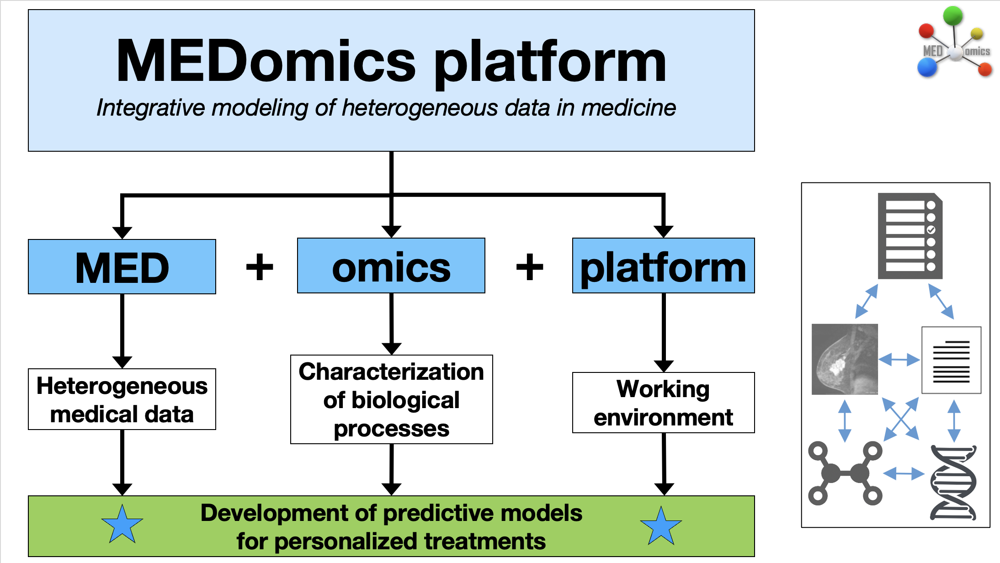
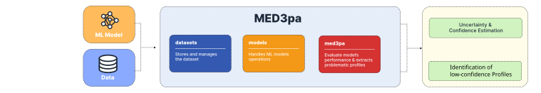

# 👋 Welcome!


MED3pa is published as **pre-releases**, the most recent being v0.1.0-alpha.5. They run the whole pipeline, but interfaces and file formats may still change between builds. Installers are on the [releases page](https://github.com/MEDomicsLab/MED3pa-app/releases).


Welcome to the MED3pa-app documentation, where you will find all the resources you need to download, install and use the application.

### MEDomics

This application is part of the [MEDomics](https://medomics-udes.gitbook.io/medomicslab-docs) project. It provides a graphical user interface to interact with the [MED3pa package](https://github.com/MEDomicsLab/MED3pa), enabling users to measure how much a trained classification model can be trusted, patient by patient and profile by profile, and to deploy that model so it abstains instead of guessing.

<figure><figcaption>
<em>MEDomics</em> overview
</figcaption></figure>

### The MED3pa application

The MED3pa-app is a graphical implementation of the MED3pa Python package. It enables the use of MED3pa's functionalities through an interactive interface: uncertainty estimation, discovery of the data profiles where a model underperforms, and declaration-rate driven deployment.

Unlike the other MEDomics modules, MED3pa does **not** train a predictive model for you. It takes a model you already have, trained anywhere and exported as ONNX, pickle or joblib, and studies its behaviour on a cohort you provide.

<figure><figcaption>
MED3pa package overview
</figcaption></figure>

### Our goal

A model that reports 0.87 AUC on a test set reports one number for a whole population. In practice it is excellent for some patients and unreliable for others, and nothing in the usual evaluation tells you which is which. MED3pa's goal is to make that distinction visible and actionable:

* estimate, per patient, how much the base model's prediction can be trusted;
* group patients into readable profiles and show where the model consistently underperforms;
* let you choose a **declaration rate**, the share of predictions the model is allowed to make, and see exactly what performance that buys;
* deploy the model at that rate, so low-confidence cases are routed to a human instead of being answered.

The application wraps this in a three-step workflow, **Configure → Analyse → Deploy**, and stores every run in a local database so results can be revisited, compared and applied to new patients.

### Quick documentation guide

* For a high-level tour of the project, visit the [MED3pa website](https://www.med3pa.app/).
* To download and install the application, go to the [next page](quick-start.md).
* For the concepts behind the analysis (IPC, APC, MPC, declaration rate, profiles), read the [MED3pa page](med3pa/).
* For tutorials, refer to the [Analysis](med3pa/analysis/) and [Deployment](deployment.md) pages.
* Use the [_Forms_](forms/contact-us.md) section to contact us or to report an issue.
* The _Media_ section contains all our communication and interaction websites.
* If you are ready to add your touch to our application, refer to the [contribution page](contributing.md).
