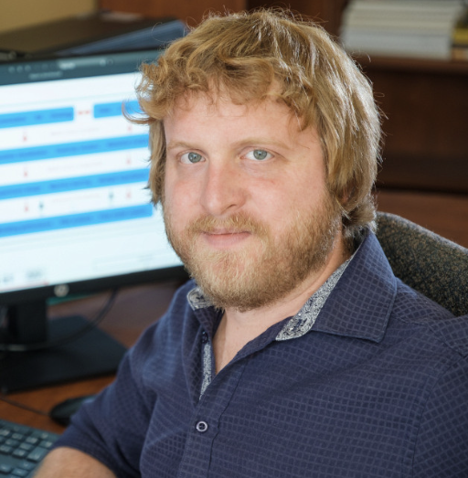
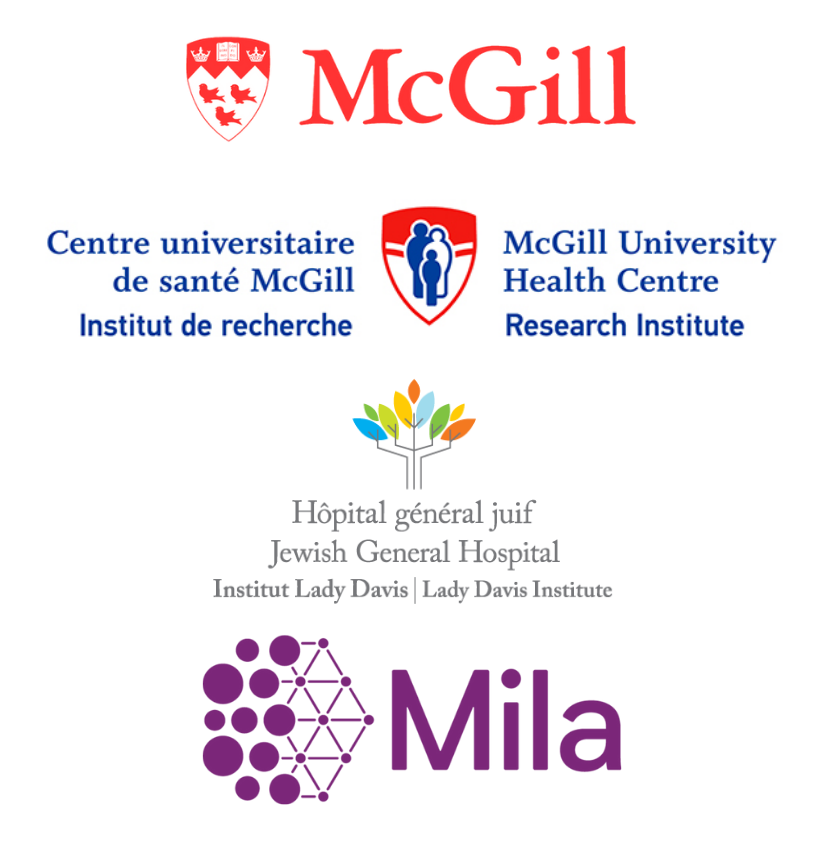
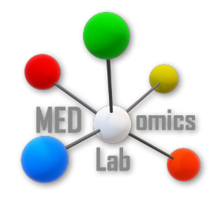
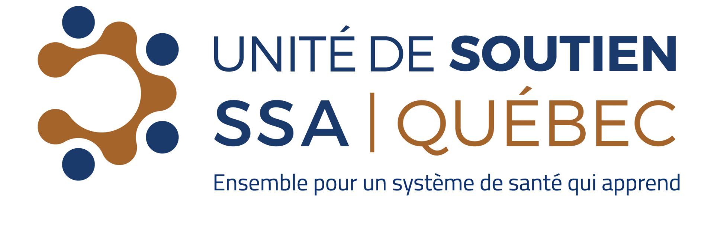

# 🤓 About us

## :pilot: About us

<table data-card-size="large" data-view="cards">
<thead><tr><th></th><th></th><th></th><th></th><th></th><th></th><th data-type="content-ref"></th><th></th></tr></thead>

<tbody>
    <tr>
        <td></td>
        <td><h2><strong>Martin Vallières, PhD</strong></h2></td>
        <td>Associate Professor, Department of Oncology</td>
        <td>McGill University</td>
        <td>Researcher – CRCHUS</td>
        <td>Canada CIFAR AI Chair, Mila</td>
        <td></td>
        <td><a href="https://www.medomicslab.com/">https://www.medomicslab.com/</a></td>
    </tr>
    <tr>
        <td></td>
        <td><h2><strong>Thanh-Tri Nguyen</strong></h2></td>
        <td>Undergraduate, Bioengineering</td>
        <td>McGill University</td>
        <td>Researcher – Medical Physics Unit - RIMUHC</td>
        <td></td>
        <!-- <td><a href="https://www.medomicslab.com/">https://www.medomicslab.com/</a></td> -->
    </tr>
</tbody>

</table>

<!-- ### 👩‍💻 Development team 

​​​​ -->
<!-- 
<table data-card-size="large" data-view="cards" data-full-width="false"><thead><tr><th></th><th></th><th></th><th></th><th></th></tr></thead><tbody><tr><td></td><td><h2>Ouael Nedjem Eddine Sahbi</h2></td><td><h4>Main developer</h4></td><td>Student (M. Sc. Software Engineering)</td><td>Université de Sherbrooke</td></tr><tr><td></td><td><h2>Hithem Lamri</h2></td><td><h4>Developer - formerly</h4></td><td>Former intern</td><td>Université de Sherbrooke</td></tr></tbody></table> -->

### 🧪 The MED3pa method and package 

The application is a graphical front end for the [MED3pa package](https://github.com/MEDomicsLab/MED3pa), developed alongside the methodological article published in [JAMIA](https://doi.org/10.1093/jamia/ocag034).

<table data-view="cards"><thead><tr><th></th><th></th><th></th></tr></thead><tbody><tr><td><h4><a href="https://www.linkedin.com/in/olivier-lefebvre-bb8837162/">Olivier Lefebvre</a></h4></td><td>Student (Ph. D. Computer Science)</td><td>Université de Sherbrooke</td></tr><tr><td><h4><a href="https://www.linkedin.com/in/martvallieres/">Martin Vallières</a></h4></td><td>Associate Professor, Department of Oncology</td><td>McGill University</td></tr></tbody></table>

### 🤝Partners 

​​​​​​​​​​​​​

<table data-view="cards"><thead><tr><th></th><th></th><th></th></tr></thead><tbody><tr><td></td><td></td><td></td></tr><tr><td></td><td></td><td></td></tr><tr><td></td><td></td><td></td></tr><tr><td></td><td></td><td></td></tr></tbody></table>
