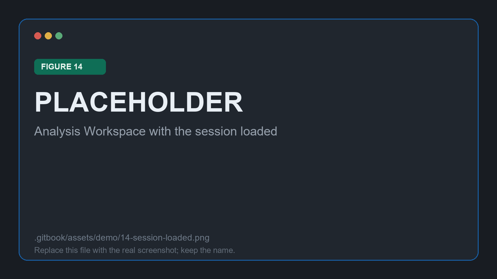
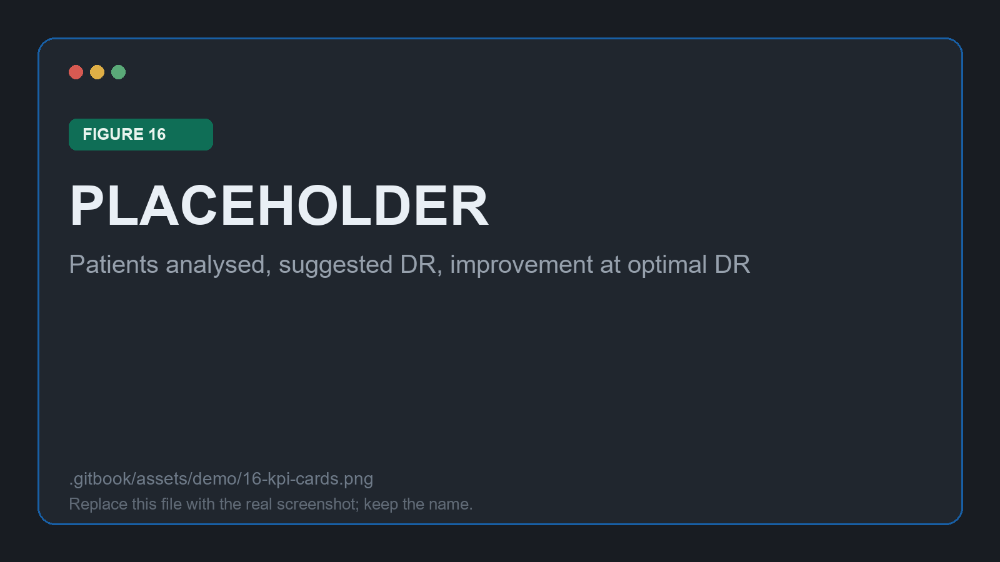

# Reading the results

Step 2. This is where the proof of concept earns its name: everything up to here was setup, and everything after depends on the rate chosen on this page.

## The session

A run launched from the Configuration page opens here already loaded. Older ones are picked from the selector, or from Session History.

<figure><figcaption>
Figure 14: session <code>{{SESSION_NAME}}</code> loaded in the Analysis Workspace
</figcaption></figure>

**⚙ Saved configuration** unfolds the settings the run was made with. It is worth opening once even when you have just configured the run yourself, because it is the record that makes two sessions comparable weeks later.

<figure><figcaption>
Figure 15: the saved configuration, recorded with the session
</figcaption></figure>

## What the headline figures say

<figure><figcaption>
Figure 16: patients analysed, suggested declaration rate, improvement at that rate
</figcaption></figure>

For this cohort, with `Auc` selected as the metric:

| Card | Value |
| --- | --- |
| Patients analysed | `{{N_PATIENTS}}` |
| Suggested declaration rate | `{{SUGGESTED_DR}}` |
| Improvement at optimal DR | `{{IMPROVEMENT}}` (`{{AUC_FULL}}` to `{{AUC_AT_DR}}`) |

The third card is the one to read carefully. It compares the metric at the suggested rate against the same metric over the whole population, which is the number a conventional validation report would have quoted. The gap between them is the part of the model's performance that was being hidden by averaging.


Changing the metric in the dropdown moves the suggested rate with it. Optimal rates differ per metric, and a model tuned for AUC may want to abstain far less than the same model judged on F1. Pick the metric the deployment actually cares about before reading the suggestion.


## The declaration-rate curve

At a declaration rate of 100% the model answers for everyone, and the curve reports what ordinary validation reports.

<figure><figcaption>
Figure 17: declaration rate at 100%, the model answering for every stay
</figcaption></figure>

Lowering the rate withholds the least confident predictions first. Reading the curve from right to left answers the deployment question directly: what does accuracy become if the model is allowed to stay quiet about the hardest cases, and how many patients does that silence cost?

<figure><figcaption>
Figure 18: metrics by declaration rate across the full range
</figcaption></figure>

Two readings matter more than the shape itself:

* **A curve that rises as the rate falls** is a model whose own uncertainty is informative. The predictions it is unsure about really are the ones it gets wrong, which is what makes abstention worth anything.
* **A flat curve** is a warning. Withholding predictions is buying nothing, which usually means the confidence estimate carries little signal for this cohort.

<figure><figcaption>
Figure 19: the curve at the chosen rate of {{CHOSEN_DR}}, with lost-profile markers on the DR axis
</figcaption></figure>

At the rate this demo settles on, the slider reports a minimum confidence of `{{MIN_CONFIDENCE}}` and `{{POPULATION_KEPT}}` of the cohort still answered for.


Population kept is not the same number as the declaration rate. It is measured at the operating point immediately below the current threshold, so it describes what is really retained rather than the nominal rate.


## The profiles

The tree partitions the same cohort into readable rules. Colouring by mean confidence level gives the fastest read of where the model is comfortable.

<figure><figcaption>
Figure 20: the APC profile tree over the whole population
</figcaption></figure>

Lowering the declaration rate fades profiles out as they lose their patients. A profile that disappears early is one the model is uniformly unsure about, not merely one that is small.

<figure><figcaption>
Figure 21: the same tree at {{CHOSEN_DR}}; the faded nodes are lost at this rate
</figcaption></figure>

Here, `{{LOST_PROFILE_RULE}}` drops out at around `{{LOST_PROFILE_DR}}`, and the dot marking it on the DR axis of the curve beside it is the same event seen from the other side.

Clicking a node opens its detail: the profile path, its share of the population, its mean confidence, and a bar per metric for the base model's performance **inside that profile**.

<figure><figcaption>
Figure 22: base-model performance within one profile
</figcaption></figure>

Two profiles are worth contrasting in this cohort:

| Profile | Base-model performance |
| --- | --- |
| `{{PROFILE_RULE_1}}` | `{{PROFILE_1_METRIC}}` |
| `{{PROFILE_RULE_2}}` | `{{PROFILE_2_METRIC}}` |


This table is the deliverable a model owner can act on. A weak profile is a concrete instruction: gather more of these patients, or retrain with them weighted, or route them to a human by policy rather than by threshold.


## Choosing the rate

The suggested rate optimises one metric. The rate you deploy is a judgement that also weighs how many patients you are willing to leave unanswered, and who they turn out to be. A rate that looks excellent on the curve but silences an entire profile is a different proposition from one that thins every profile evenly, and the tree beside the curve is what makes the difference visible.

With the rate chosen, continue to [Deploying and applying](deployment.md).
