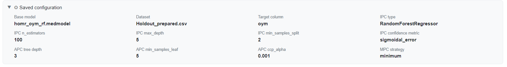
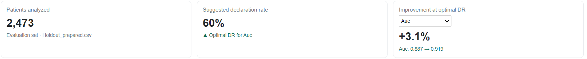
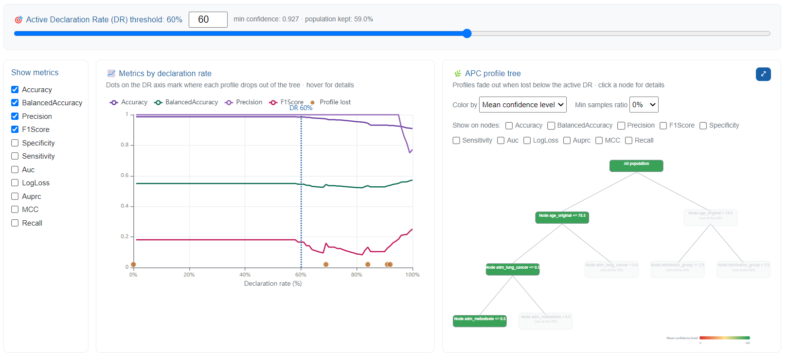
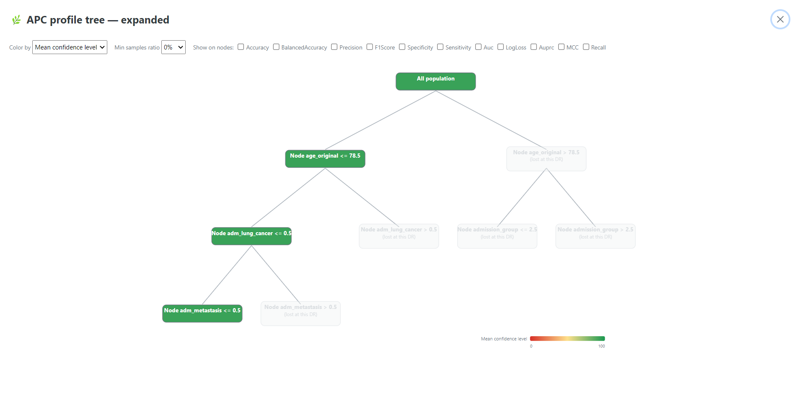
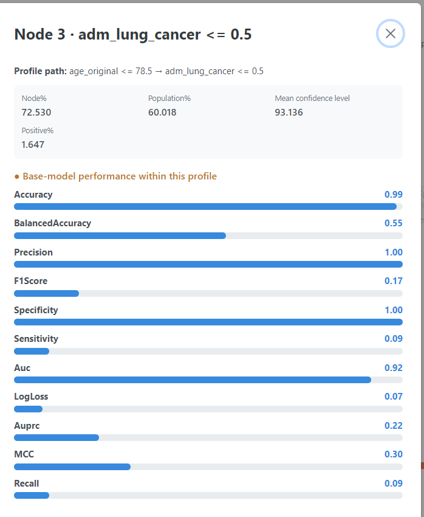
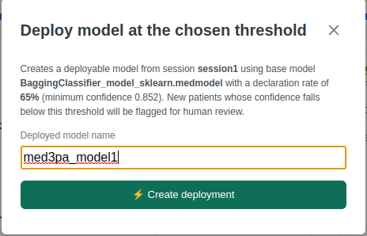

# Reading the results

Step 2. This is where the proof of concept earns its name: everything up to here was setup, and everything after depends on the rate chosen on this page.

## The session

A run launched from the Configuration page opens here already loaded. Older ones are picked from the selector, or from Session History.

<figure><figcaption><p>Figure 9: the session selector, with <code>session1</code> loaded</p></figcaption></figure>

**⚙ Saved configuration** unfolds the settings the run was made with. It is worth opening once even when you have just configured the run yourself, because it is the record that makes two sessions comparable weeks later.

<figure><figcaption><p>Figure 10: the configuration recorded with the session</p></figcaption></figure>

| Setting | Value |
| --- | --- |
| Base model | `homr_oym_rf.medmodel` |
| Dataset | `Holdout_prepared.csv` |
| Target column | `oym` |
| IPC | `RandomForestRegressor`, `n_estimators` 100, `max_depth` 5, `min_samples_split` 2, `sigmoidal_error` |
| APC | tree depth 3, `min_samples_leaf` 5, `ccp_alpha` 0.001 |
| MPC | `minimum` |

## What the headline figures say

<figure><figcaption><p>Figure 11: patients analysed, suggested declaration rate, and improvement at that rate</p></figcaption></figure>

| Card | Value |
| --- | --- |
| Patients analysed | 2,473, from `Holdout_prepared.csv` |
| Suggested declaration rate | **60%** |
| Improvement at optimal DR | **+3.1%**, `Auc: 0.887 → 0.919` |

The third card carries a dropdown, and it drives the other two. **Whichever metric you select there, the application recomputes the optimal declaration rate for that metric** and moves the suggestion and the active rate to it. With `Auc` selected, the optimum sits at 60%: letting the model abstain on the least confident predictions lifts AUC from 0.887 over the whole cohort to 0.919 over the ones it still answers for.


Optimal rates differ per metric, so this dropdown is the first thing to touch on a new session. A model judged on F1 may want to abstain far more than the same model judged on AUC, and the rate you eventually deploy should be the optimum for the metric the deployment actually cares about, not for whichever one happened to be selected.


The improvement figure is worth reading carefully: it compares the metric at the suggested rate against the same metric over the whole population, which is the number a conventional validation report would have quoted. The gap between them is the part of the model's performance that was being hidden by averaging.

## The declaration-rate curve

Lowering the rate withholds the least confident predictions first. Reading the curve from right to left answers the deployment question directly: what does accuracy become if the model is allowed to stay quiet about the hardest cases, and how many patients does that silence cost?

<figure><figcaption><p>Figure 12: metrics by declaration rate, beside the profile tree, both at the active rate of 60%</p></figcaption></figure>

At 60% the slider reports a minimum confidence of **0.927** and **59.0%** of the cohort still answered for. Two readings matter more than the shape itself:

* **A curve that rises as the rate falls** is a model whose own uncertainty is informative. The predictions it is unsure about really are the ones it gets wrong, which is what makes abstention worth anything.
* **A flat curve** says the confidence estimate carries little signal for that metric on that cohort, and that withholding predictions is buying nothing.

The dots along the DR axis are the profiles dropping out of the tree, one dot per profile, at the exact rate where it goes. They are the same events as the greying nodes in the tree beside them.


Population kept is not the same number as the declaration rate, which is why 60% and 59.0% differ here. It is measured at the operating point immediately below the current threshold, so it describes what is really retained rather than the nominal rate.


## The profiles

The tree partitions the same cohort into readable rules. Colouring by mean confidence level gives the fastest read of where the model is comfortable, and the ⤢ button expands it to full screen with the same controls.

<figure><figcaption><p>Figure 13: the expanded profile tree at 60%. The greyed nodes are the profiles lost at this rate.</p></figcaption></figure>

At depth 3 over 244 features, the tree split on age and on two cancer flags:

```
age_original <= 78.5 & adm_lung_cancer <= 0.5 & adm_metastasis <= 0.5
age_original <= 78.5 & adm_lung_cancer > 0.5
age_original > 78.5 & admission_group <= 2.5
```

That is the payoff of keeping the tree shallow. Out of 244 columns, the profile boundaries land on three that a clinician can reason about immediately.

The greying is the part to read alongside the curve. At 60% the entire `age_original > 78.5` branch has gone, along with both cancer-positive leaves. Everything MED3pa is still willing to answer for sits in one corner of the tree: younger stays without a lung-cancer or metastasis flag. A rate that looks like a modest trade on the curve turns out, in the tree, to be a decision about **which kinds of patient the model still speaks for**.

Clicking a node opens its detail: the profile path, its share of the population, its mean confidence, and a bar per metric for the base model's performance **inside that profile**.

<figure><figcaption><p>Figure 14: base-model performance within the largest surviving profile</p></figcaption></figure>

For `age_original <= 78.5 → adm_lung_cancer <= 0.5`:

| | |
| --- | --- |
| Share of its parent node | 72.5% |
| Share of the population | 60.0% |
| Mean confidence level | 93.1 |
| Positive rate | 1.6% |

| Metric | Value | Metric | Value |
| --- | --- | --- | --- |
| Accuracy | 0.99 | Sensitivity | 0.09 |
| BalancedAccuracy | 0.55 | Auc | 0.92 |
| Precision | 1.00 | LogLoss | 0.07 |
| F1Score | 0.17 | Auprc | 0.22 |
| Specificity | 1.00 | MCC | 0.30 |
| Recall | 0.09 | | |

This is exactly why per-profile metrics are worth opening rather than trusting a headline. Accuracy of 0.99 and precision of 1.00 look immaculate, but the positive rate in this profile is 1.6%: the model reaches that accuracy largely by predicting the negative class, and sensitivity of 0.09 says it finds fewer than one in ten of the deaths that do occur here. A single aggregate number would have shown the 0.99 and hidden the 0.09.


Per-profile performance is the deliverable a model owner can act on. A weak profile is a concrete instruction: gather more of these patients, or retrain with them weighted, or route them to a human by policy rather than by threshold.


## Choosing the rate

The suggested rate optimises one metric. The rate you deploy is a judgement that also weighs how many patients you are willing to leave unanswered, and who they turn out to be. A rate that looks excellent on the curve but silences an entire branch of the tree is a different proposition from one that thins every profile evenly, and the tree beside the curve is what makes the difference visible.

**▶ Create Model** freezes the decision. The dialog restates exactly what is being frozen, so it is recorded rather than implied.

<figure><figcaption><p>Figure 15: the deployment dialog, naming the session, the base model, the rate and the minimum confidence it corresponds to</p></figcaption></figure>

Continue to [Deploying and applying](deployment.md).
