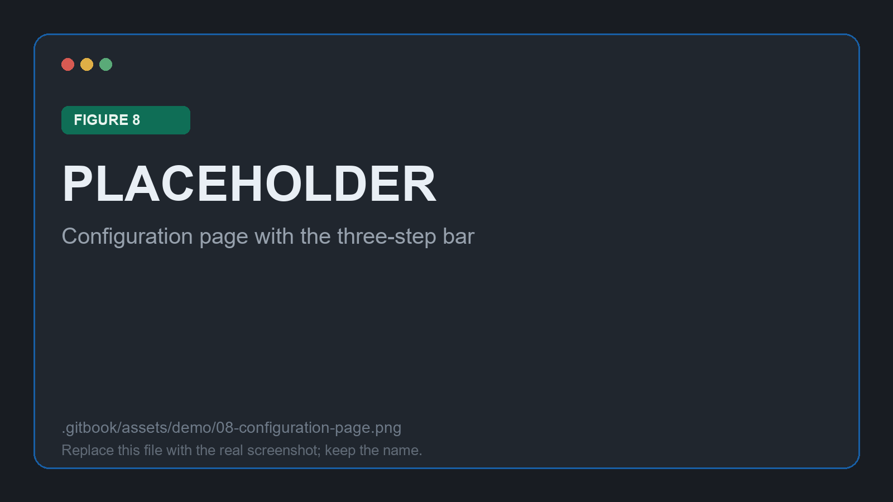

# Configuring the run

Step 1 of the workflow. The left column of the Configuration page says **what** is being analysed; the right column says **how** confidence is estimated. The figures come from `session1`.

<figure><figcaption>
Figure 8: the Configuration page, filled in and ready to run
</figcaption></figure>

## Declaring the inputs

The **baseline prediction model** is where the audit begins. Two sources are offered, and this demo uses the first: the `.medmodel` imported in the previous stage. The second, _Predicted probabilities_, reads a column of the dataset instead, and exists for models that cannot be exported with a predict_proba() function.

<figure><figcaption>
Figure 9: the imported <code>BaggingClassifier_model_sklearn.medmodel</code> selected as the base model
</figcaption></figure>

The remaining three fields identify the cohort and the run:

| Field | Value used here |
| --- | --- |
| **Training Data (.csv)** | `Holdout_homr_any_visit_10pct.csv` |
| **Target column** | `oym` |
| **Session Name** | `session1` |

<figure><figcaption>
Figure 10: cohort, target column and session name
</figcaption></figure>


The cohort selected here is the **holdout** file rather than the larger learning split sitting beside it. That is the right way round: MED3pa should measure how the model behaves on stays it did not learn from, because running the analysis over training data flatters every confidence estimate.



The session name is how the run is found again: it labels the session in the Analysis Workspace selector and in Session History. Naming a run for what it varies, rather than for the date, pays off as soon as there are several of them, and this proof of concept ended up with three.


## Configuring the confidence method

The right column holds four collapsible sections. This run keeps every prefilled value, which makes it reproducible and gives a baseline to vary from later. Each field carries a ⓘ hover hint in the interface, and the [Configuration reference](../med3pa/analysis/configuration.md) documents them all.

## Running

**⚡ Run Analysis** hands the configuration to the Go server, which runs MED3pa in the Python environment and streams progress back. When it finishes, the session is saved and the application switches straight to the Analysis Workspace with it loaded.


A run that fails within a second or two is almost always the environment rather than the configuration. Check the interpreter on the System page before changing any hyperparameter.


Continue to [Reading the results](analysis.md).
