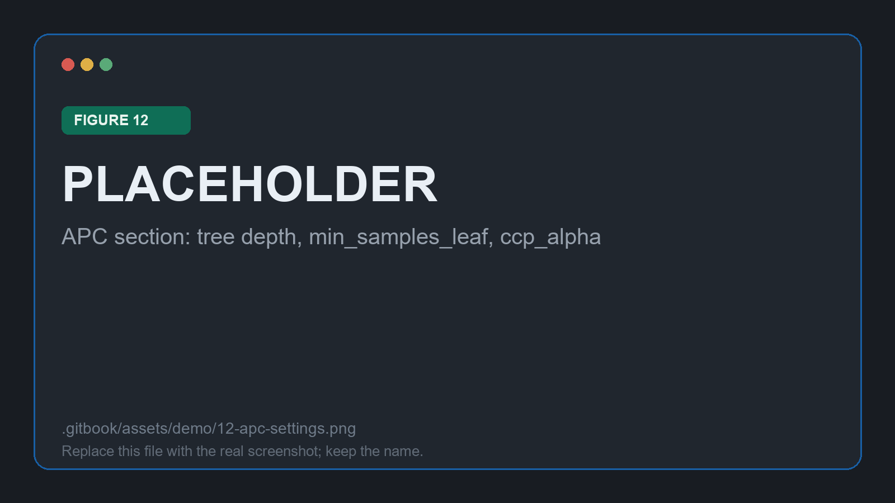

# Configuring the run

Step 1 of the workflow. The left column of the Configuration page says **what** is being analysed; the right column says **how** confidence is estimated.

<figure><figcaption>
Figure 8: the Configuration page, with the three-step bar at the top
</figcaption></figure>

## Declaring the inputs

The **baseline prediction model** is where the audit begins. Two sources are offered, and this demo uses the first: the `.medmodel` imported in the previous stage. The second, _Predicted probabilities_, reads a column of the dataset instead, and exists for models that cannot be exported at all.

<figure><figcaption>
Figure 9: selecting the imported base model
</figcaption></figure>

The remaining three fields identify the cohort and the run:

| Field | Value used here |
| --- | --- |
| **Training Data (.csv)** | `MIMIC_95.csv` |
| **Target column** | `deceased` |
| **Session Name** | `{{SESSION_NAME}}` |

<figure><figcaption>
Figure 10: cohort, target column and session name
</figcaption></figure>


The session name is how the run is found again: it labels the session in the Analysis Workspace selector and in Session History. Naming a run for what it varies, rather than for the date, pays off as soon as there are several of them.


## Configuring the confidence method

The right column holds four collapsible sections. This demo keeps every prefilled value, which makes the run reproducible and gives a baseline to vary from later. Each field carries a ⓘ hover hint in the interface, and the [Configuration reference](../med3pa/analysis/configuration.md) documents them all.

### IPC

The IPC is the regressor that learns, from a patient's features alone, how much the base model can be trusted for that patient.

| Field | Value | Why it matters here |
| --- | --- | --- |
| `ipc_type` | Random forest | The default, and the only family that can be grid searched usefully |
| `n_estimators` | 100 | More trees smooth the confidence estimate; the cost is runtime |
| `max_depth` | 5 | Deep enough to capture structure across fifteen features without chasing noise |
| `min_samples_split` | 2 | Left at the default |
| Confidence metric | Sigmoidal | What the IPC is trained to reproduce |

<figure><figcaption>
Figure 11: the IPC section expanded
</figcaption></figure>

The grid-search fields stay empty, so the IPC trains directly with the values above. Filling in any one of them turns a cross-validated search on and lengthens the run considerably.

### APC

The APC is the decision tree that splits the cohort into profiles. It is the part of the configuration that most changes what the results look like.

| Field | Value | Why it matters here |
| --- | --- | --- |
| Tree depth | 3 | At most eight leaves, so the profiles stay readable |
| `min_samples_leaf` | 5 | Keeps profiles from shrinking to a handful of stays |
| `ccp_alpha` | 0.001 | Light pruning |

<figure><figcaption>
Figure 12: the APC section, controlling how many profiles come out
</figcaption></figure>


Depth is the dial to reach for first. A depth of 3 yields profiles of at most three conditions, which is roughly the limit of what reads as a clinical description. Raising it finds narrower groups at the cost of rules nobody can act on.


### MPC and experiment settings

The MPC combines the per-patient IPC and the per-profile APC into the single value the declaration decision uses. This demo keeps **minimum**, the conservative choice: a patient is trusted only when the individual estimate and the profile agree.

The samples-ratio sweep stays at its default of 0 to 10 in steps of 5, so profile extraction is repeated at three population thresholds and the tree can be read at three levels of granularity. **Evaluate models** stays on, which scores the IPC and APC themselves and is worth the extra runtime on a first run.

<figure><figcaption>
Figure 13: MPC strategy, experiment settings, and the run in progress
</figcaption></figure>

## Running

**⚡ Run Analysis** hands the configuration to the Go server, which runs MED3pa in the Python environment and streams progress back. When it finishes, the session is saved and the application switches straight to the Analysis Workspace with it loaded.


A run that fails within a second or two is almost always the environment rather than the configuration. Check the interpreter on the System page before changing any hyperparameter.


Continue to [Reading the results](analysis.md).
