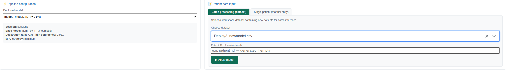
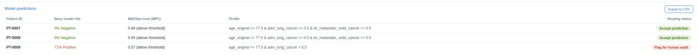
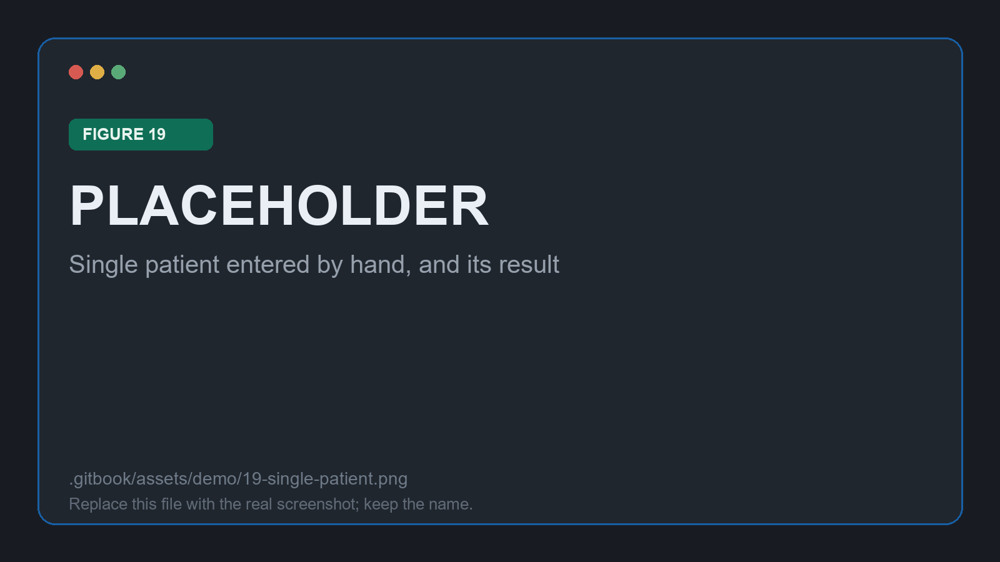

# Deploying and applying

Step 3. A **deployed model** is a session frozen at one declaration rate: the base model, the trained IPC and APC, the MPC strategy, and the confidence threshold matching that rate.

## The deployed model

Selecting a deployment on the Deployment page restates what it carries, so there is no ambiguity about which model is about to answer.

<figure><figcaption>
Figure 16: the deployed model, its session, its base model and its threshold
</figcaption></figure>

| Property | Value |
| --- | --- |
| Base model | `homr_oym_rf.medmodel` |
| Declaration rate | The rate frozen in the previous stage |
| Minimum confidence | The confidence matching that rate |
| MPC strategy | `minimum` |

The threshold is what changes the model's behaviour: patients whose confidence falls below it are flagged for human review instead of being answered.


Several deployments can be created from one session at different rates, and they coexist, each appearing in the selector with its rate in the label. Comparing a conservative deployment against a permissive one over the same batch is the cheapest way to see what the rate is actually buying. The figures on this page come from such a comparison, so the deployment name and rate they show differ from the ones you will have.


## Applying it in batch

The **Batch processing** tab takes any dataset in the workspace. The demo applies the deployed model to [`Deploy3_newmodel.csv`](../.gitbook/assets/Deploy3_newmodel.csv), three stays that took no part in the analysis. This is the honest test: the confidence models are meeting these patients for the first time.

<figure><figcaption>
Figure 17: choosing the batch. The selector lists every dataset in the workspace, including the cohort the analysis was run over.
</figcaption></figure>

The file needs every feature column the model was trained on; a missing one stops the run with an explicit message rather than a silent misalignment. A **Patient ID column** is optional, and identifiers are generated when none is given, which is what happened here: the three stays came back as `PT-0007` through `PT-0009`.

Each prediction returns the base model's probability, the confidence values, the profile the patient fell into, and a routing decision.

<figure><figcaption>
Figure 18: the batch result, two accepted and one flagged
</figcaption></figure>

| Patient | Base model risk | MPC | Routing |
| --- | --- | --- | --- |
| `PT-0007` | 0%, negative | 0.94, above threshold | 🟢 Accept prediction |
| `PT-0008` | 5%, negative | 0.94, above threshold | 🟢 Accept prediction |
| `PT-0009` | 71%, positive | 0.57, below threshold | 🔴 Flag for human audit |

Read that third row carefully, because it is the whole argument for the method in one line. The base model is **confident**: 71% for the positive class, comfortably past its 0.5 decision threshold. A conventional pipeline would have returned that number and stopped. MED3pa withholds it, because this patient sits in the lung-cancer profile where the model has been measured performing poorly, and the confidence estimate says so.


The third routing status, 🟡 **Caution / review**, does not appear in this batch. It marks a patient whose individual confidence clears the bar while their profile does not, a failure mode a single confidence score cannot express. Separating those cases is the practical payoff of estimating confidence twice.


**Export to CSV** writes the whole table out with the underlying numbers, one row per patient, which is what a downstream system or an audit would consume.

## Applying it to one patient

The **Single patient** tab builds one numeric field per feature the deployed model declares, in the order the model expects them, and all of them must be filled before the model can be applied. With a model 244 features wide that is a long form, and the batch route is usually the practical one.

<figure><figcaption>
Figure 19: single-patient entry. Screenshot not captured yet.
</figcaption></figure>


These fields are numeric. A categorical feature such as `admission_group` or `service_group` has to be entered as the same numeric encoding used in the training data, and there is nothing in the form to catch a wrong code. Keep the encoding to hand.


Every prediction from either tab is also written to the workspace database, which is what makes the next stage possible. Continue to [One patient in detail](patient.md).
