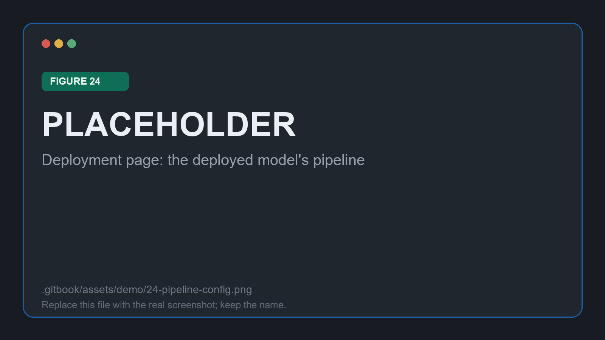
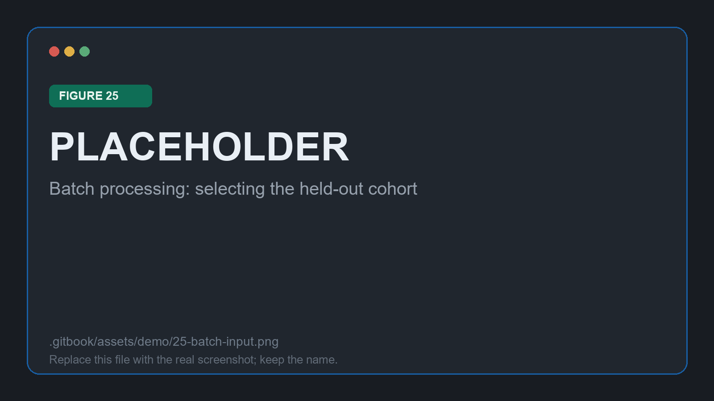

# Deploying and applying

Step 3. A **deployed model** is the session frozen at one declaration rate: the base model, the trained IPC and APC, the MPC strategy, and the confidence threshold matching that rate.

## Creating the deployment

**▶ Create Model** in the Analysis Workspace opens a dialog that restates exactly what is being frozen, so the decision is recorded rather than implied.

<figure><figcaption>
Figure 23: freezing session <code>{{SESSION_NAME}}</code> at {{CHOSEN_DR}} into <code>{{DEPLOYMENT_NAME}}</code>
</figcaption></figure>

From this point the model behaves differently from the one imported at the start: patients whose confidence falls below `{{MIN_CONFIDENCE}}` are flagged for human review instead of being answered.

<figure><figcaption>
Figure 24: the deployed model's pipeline on the Deployment page
</figcaption></figure>


Several deployments can be created from one session at different rates, and they coexist. Comparing a conservative deployment against a permissive one over the same batch is the cheapest way to see what the rate is actually buying.


## Applying it in batch

The demo applies `{{DEPLOYMENT_NAME}}` to `{{HOLDOUT_FILE}}`, a held-out set of `{{N_HOLDOUT}}` stays that took no part in the analysis. This is the honest test: the confidence models are meeting these patients for the first time.

<figure><figcaption>
Figure 25: selecting the held-out cohort for batch inference
</figcaption></figure>

The file needs every feature column the model was trained on; a missing one stops the run with an explicit message rather than a silent misalignment. A **Patient ID column** is optional, and identifiers are generated when none is given. If the held-out file still carries `deceased`, it is dropped automatically, so an already-labelled file can be reused without editing.

Each prediction comes back with the base model's probability, the three confidence values, the profile the patient fell into, and a routing decision.

<figure><figcaption>
Figure 26: predictions, routed accept / caution / flag
</figcaption></figure>

| Status | Condition | Count in this batch |
| --- | --- | --- |
| 🟢 Accept prediction | MPC ≥ threshold **and** APC ≥ threshold | `{{N_ACCEPT}}` |
| 🟡 Caution / review | MPC ≥ threshold, APC below | `{{N_CAUTION}}` |
| 🔴 Flag for human audit | MPC below threshold | `{{N_FLAG}}` |


The middle row is the one worth dwelling on. Those patients cleared the individual confidence bar but belong to a profile the model handles poorly, which is a failure mode a single confidence score cannot express. Separating them is the practical payoff of estimating confidence twice.


**Export to CSV** writes the whole table out with the underlying numbers, one row per patient, which is what a downstream system or an audit would consume.

## Applying it to one patient

The **Single patient** tab builds one numeric field per feature the deployed model declares, in the order the model expects them. All fifteen must be filled before the model can be applied.

<figure><figcaption>
Figure 27: one stay entered by hand, and how it was routed
</figcaption></figure>


These fields are numeric. A categorical feature such as `admissiontype` has to be entered as the same numeric encoding used in the training data, and there is nothing in the form to catch a wrong code. Keep the encoding to hand.


Every prediction from either tab is also written to the workspace database, which is what makes the next stage possible. Continue to [One patient in detail](patient.md).
