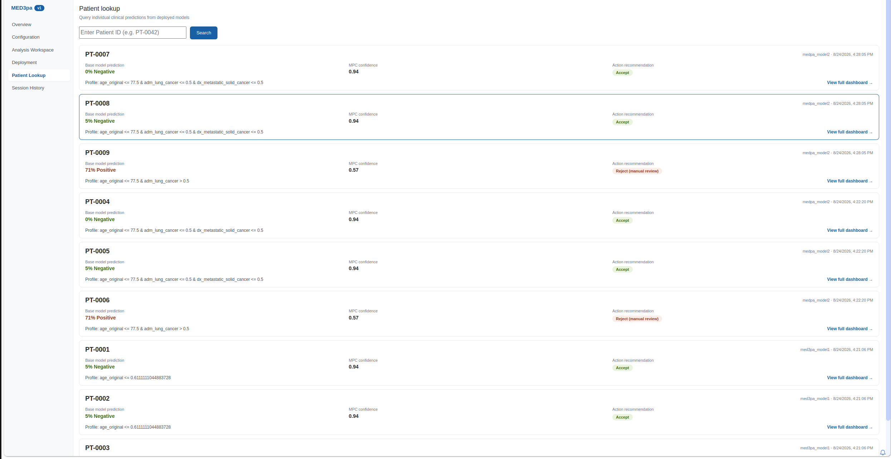
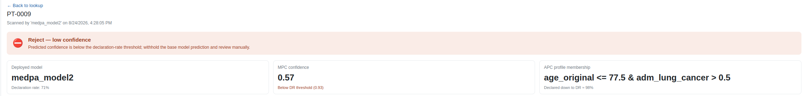
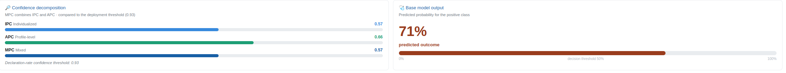
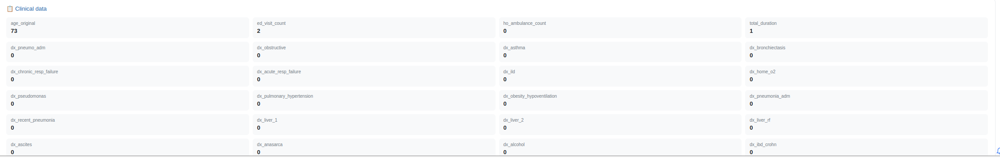
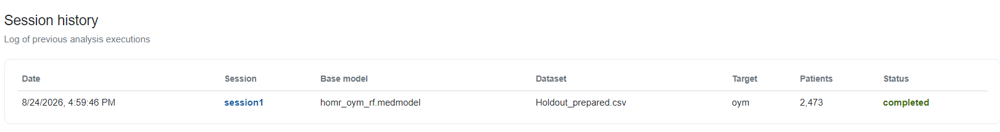

# One patient in detail

The batch table gives a verdict per patient. This stage answers the question that follows it: **why that verdict, for this patient?** The figures follow `PT-0009`, the stay the deployed model refused to answer for.

## Finding them

Patient Lookup searches every patient any deployed model in the workspace has scanned. Entering an identifier narrows the list; leaving the box empty lists everything.

<figure><figcaption>
Figure 20: search results, one card per scan, newest first
</figcaption></figure>

Each card summarises one scan: the base model's prediction, the MPC confidence, the recommendation, the profile, and which deployed model produced it. When a workspace holds more than one deployment, the same patient appears once per deployment that has scanned them, which makes two rates easy to compare side by side.

Clicking a card opens the full dashboard.

## Reading the dashboard

<figure><figcaption>
Figure 21: the recommendation banner and headline figures for <code>PT-0009</code>
</figcaption></figure>

The banner states the routing in words: **Reject, low confidence.** Beneath it, three figures place the patient against the deployment: the deployed model and its rate, the MPC confidence against the threshold, and the APC profile the patient falls into.

The profile card also reports the lowest declaration rate at which this patient would still have been declared. For `PT-0009` that is **DR ≈ 98%**, a stark number: this stay only survives at rates so permissive that the model is answering for essentially everyone, which makes it one of the least trusted patients in the batch rather than a borderline call.

## Why the model was not trusted

<figure><figcaption>
Figure 22: IPC, APC and MPC against the deployment threshold, beside the base model's own output
</figcaption></figure>

The decomposition is the heart of the page, because the two estimates can disagree and the reason for a verdict lies in which one fell short:

| Signal | Value | Reading |
| --- | --- | --- |
| IPC | 0.57 | How much this individual prediction can be trusted |
| APC | 0.66 | How the base model performs across this patient's profile |
| MPC | 0.57 | The combination compared against the threshold |

Both estimates are low, and both are far below the bar. Under the `minimum` strategy the MPC follows whichever is lower, so it takes the IPC's 0.57. Even the more forgiving APC would not have cleared the threshold, so this is not a case of a patient being penalised for the company they keep: the model is unsure about this stay on both readings.

Beside it, the base model's own output: **71%** for the positive class, well past its 50% decision threshold. That contrast is the point of the whole page. A confident prediction and an untrustworthy one are different things, and only the second column tells you which you are holding.

## Where they sit in the cohort

<figure><figcaption>
Figure 23: the deployed rate and the patient's own position marked on the curve, with their profile chain highlighted in the tree
</figcaption></figure>

The same two charts from the Analysis Workspace are redrawn for this patient. The curve marks the deployed rate and the highest rate at which this patient would still be declared; the tree highlights the path from the root down to their leaf. Together they place one individual inside the population-level result the analysis produced, which is the round trip the whole method exists to make.

## The record behind the number

<figure><figcaption>
Figure 24: the clinical data this prediction was made from
</figcaption></figure>

The dashboard closes with the feature values themselves, every column the model was given for this stay. For `PT-0009` that starts `age_original 73`, `ed_visit_count 2`, `ho_ambulance_count 0`, `total_duration 1`, followed by the long tail of diagnostic flags.

This is what makes the page auditable rather than merely informative. A reviewer handed a flagged prediction can see the inputs, the profile those inputs put the patient in, and the two confidence estimates that followed, without leaving the screen.

## The record of what was run

<figure><figcaption>
Figure 25: Session History for this workspace
</figcaption></figure>

Session History lists every analysis saved in the workspace with its date, session name, base model, dataset, target column, cohort size and status. For this proof of concept that is a single completed row: `session1`, run against `homr_oym_rf.medmodel` and `Holdout_prepared.csv` on the `oym` target, over 2,473 patients. Clicking the row reopens it in the Analysis Workspace exactly as it was.

That closes the loop. The same workspace now holds the cohort, the audited model, the session behind the audit, the deployment made from it, and every patient it has answered for, which is the provenance a clinical deployment has to be able to show.

## Where to go next

* Vary one thing and re-run. APC tree depth changes what the profiles look like; the MPC strategy changes who gets withheld. Two sessions read side by side are more informative than one.
* Change the metric on the third headline card and watch the suggested rate move with it, then decide which metric the deployment should actually be tuned for.
* Take the same experiment to code with the [MED3pa package](../python-package.md) when you need to batch many runs.
* Read the method itself in the [JAMIA article](https://doi.org/10.1093/jamia/ocag034).
