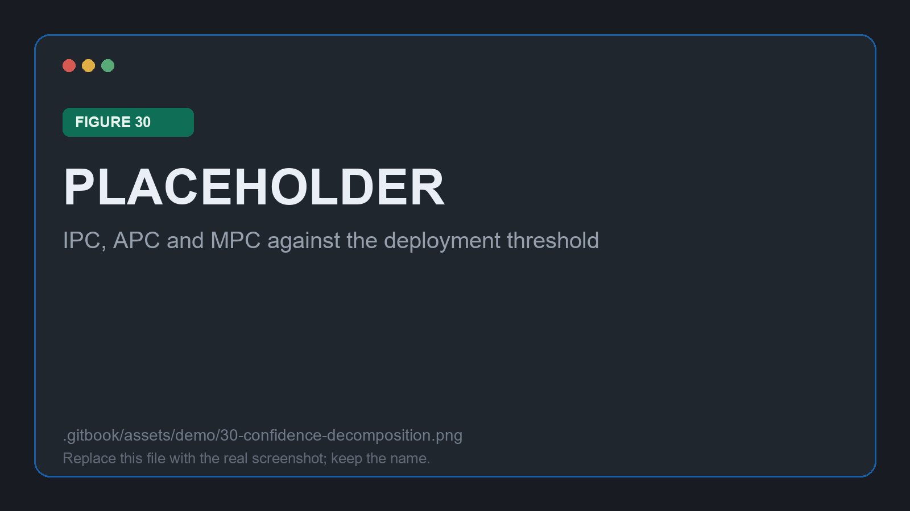
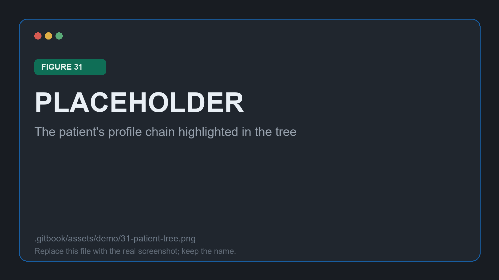

# One patient in detail

The batch table gives a verdict per patient. This stage answers the question that follows it: **why that verdict, for this patient?**

## Finding them

Patient Lookup searches every patient any deployed model in the workspace has scanned. Entering an identifier narrows the list; leaving the box empty lists everything.

<figure><figcaption>
Figure 28: search results, one card per scan
</figcaption></figure>

Each card summarises one scan: the base model's prediction, the MPC confidence, the recommendation, the profile, and which deployed model produced it. Clicking one opens the full dashboard. This demo follows `{{PATIENT_ID}}`, routed **{{PATIENT_ROUTING}}**.

## Reading the dashboard

<figure><figcaption>
Figure 29: the recommendation banner and the headline figures for <code>{{PATIENT_ID}}</code>
</figcaption></figure>

The banner states the routing in words. Beneath it, three figures place the patient against the deployment:

| Figure | Value for `{{PATIENT_ID}}` |
| --- | --- |
| Deployed model and its rate | `{{DEPLOYMENT_NAME}}`, {{CHOSEN_DR}} |
| MPC confidence against the threshold | `{{PATIENT_MPC}}` against `{{MIN_CONFIDENCE}}` |
| APC profile membership | `{{PATIENT_PROFILE}}` |

The profile card also reports the lowest declaration rate at which this patient would still have been declared, which is a direct measure of how marginal the case is. A patient who survives down to a very low rate is one the model is genuinely sure about; one who drops out just past the deployed rate is a borderline call that a slightly different threshold would have answered.

## Why the model was or was not trusted

<figure><figcaption>
Figure 30: IPC, APC and MPC drawn against the deployment threshold
</figcaption></figure>

The decomposition is the heart of the page, because the two estimates can disagree and the reason for a verdict lies in which one fell short:

| Signal | Value | Reading |
| --- | --- | --- |
| IPC | `{{PATIENT_IPC}}` | How much this individual prediction can be trusted |
| APC | `{{PATIENT_APC}}` | How the base model performs across this patient's profile |
| MPC | `{{PATIENT_MPC}}` | The combination actually compared against the threshold |

Under the `minimum` strategy the MPC follows whichever of the two is lower, so a patient can be withheld because of the company they keep rather than anything about their own record. That is a defensible reason to withhold a prediction, and being able to say so out loud is the point.

Beside it, the base model's own output is shown against its decision threshold: `{{PATIENT_PROB}}` for the positive class.

## Where they sit in the cohort

<figure><figcaption>
Figure 31: the patient's profile chain highlighted, from the root down to their leaf
</figcaption></figure>

The same two charts from the Analysis Workspace are redrawn for this patient. The curve marks the deployed rate and the highest rate at which this patient would still be declared; the tree highlights the path from the root to their leaf. Together they place one individual inside the population-level result the analysis produced, which is the round trip the whole method exists to make.

## The record of what was run

<figure><figcaption>
Figure 32: Session History for this workspace
</figcaption></figure>

Session History lists every analysis saved in the workspace with its date, base model, dataset, target column, cohort size and status. Clicking a row reopens it in the Analysis Workspace exactly as it was.

That closes the loop for this proof of concept. The same workspace now holds the cohort, the audited model, the session behind the audit, the deployment made from it, and every patient it has answered for, which is the provenance a clinical deployment has to be able to show.

## Where to go next

* Vary one thing and re-run. APC tree depth changes what the profiles look like; the MPC strategy changes who gets withheld. Two sessions read side by side are more informative than one.
* Take the same experiment to code with the [MED3pa package](../python-package.md) when you need to batch many runs.
* Read the method itself in the [JAMIA article](https://doi.org/10.1093/jamia/ocag034).
