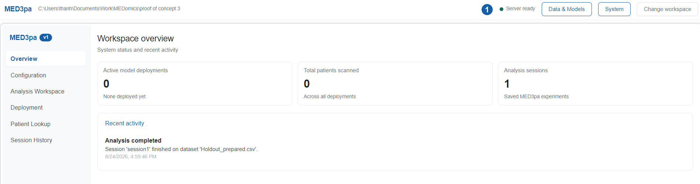
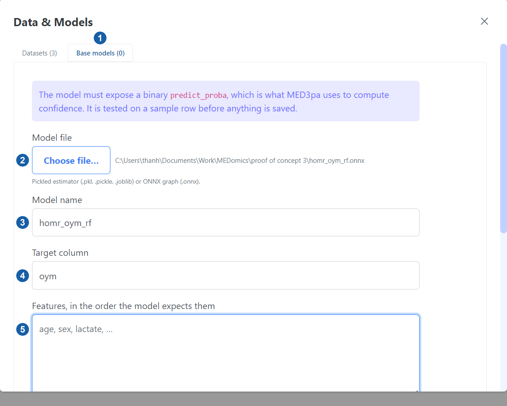
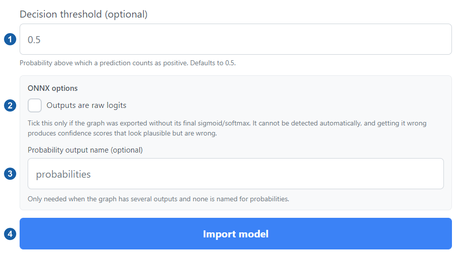

# Workspace and inputs

Nothing in MED3pa can run before a workspace exists, and no analysis can be configured before a dataset and a model are in it. This stage covers both.

## Opening the workspace

On first launch the application asks for a **workspace folder**. For this proof of concept a fresh, empty folder is the right choice: the workspace is where `DATA/` and `MODELS/` are created, and where the local MongoDB stores the sessions, deployments and patient records this walkthrough produces. Keeping the demo in its own folder keeps its sessions from mixing with other studies.

<figure><figcaption>
Figure 1: choosing the workspace folder. Folders opened before are listed under <em>Recent</em>.
</figcaption></figure>

Once a folder is chosen, the module opens on the **Overview** page behind a thin header carrying the workspace path, a status light for the Go server, and the buttons for **Data & Models** and **System**. On a new workspace every counter reads zero.

<figure><figcaption>
Figure 2: the workspace overview, with the header above it and the module's own sidebar on the left
</figcaption></figure>


If the status light is red, stop here. Open **System** and check the Python environment: the interpreter must have MED3pa installed, or every analysis will fail before it starts. See [Interface overview](../interface-overview.md#system-page) for what that page shows, and [Quick start](../quick-start.md#id-3.-python-environment) for how to build the environment.


## Importing the cohort

Open **Data & Models** from the header and stay on the **Datasets** tab. **Import CSV…** copies the chosen files into `DATA/` inside the workspace and re-scans it, which loads them into the local MongoDB and makes them selectable everywhere else.

<figure><figcaption>
Figure 3: importing the cohort. The panel reports zero datasets and zero base models, because this workspace is new.
</figcaption></figure>

Import both files this walkthrough uses:

| File | Rows | Used for |
| --- | --- | --- |
| [`Holdout_prepared.csv`](../.gitbook/assets/Holdout_prepared.csv) | 2,473 | The cohort the analysis is run over |
| [`Deploy3_newmodel.csv`](../.gitbook/assets/Deploy3_newmodel.csv) | 3 | Unseen stays, applied to the deployed model in stage 4 |


Importing takes a copy. Editing the original CSV afterwards changes nothing in the workspace, so re-import it if the cohort is regenerated.


## Importing the base model

Switch to the **Base models** tab. The model audited here is [`homr_oym_rf.onnx`](../.gitbook/assets/homr_oym_rf.onnx), a random forest predicting one-year mortality, exported to ONNX and imported straight from the file picker.

<figure><figcaption>
Figure 4: the Import External Model form, with the ONNX graph chosen and the target column set
</figcaption></figure>

Four fields carry the demo:

| Field | Value used here |
| --- | --- |
| **Model file** | `homr_oym_rf.onnx` |
| **Model name** | `homr_oym_rf`, saved as `<name>.medmodel` |
| **Target column** | `oym` |
| **Decision threshold** | `0.5`, the default |


Download [`features.txt`](../.gitbook/assets/features.txt), open it, and **copy the whole file into the features box**. It is the complete list of 244 column names in model order, comma separated, which is exactly the format the field takes. Retyping them by hand is not worth attempting.



`oym` is the target and is **not** in that list. Adding it would hand the model the answer and make every confidence estimate meaningless.


Import writes the model into `MODELS/` as a `.medmodel`. Before saving anything, the application calls the model on a sample row, so a model that cannot be called is rejected here rather than halfway through an analysis.

## ONNX inputs

An ONNX graph carries no metadata about what its outputs mean, so the form grows two extra fields when the chosen file ends in `.onnx`. Both sit at the bottom of the panel, above **Import model**.

<figure><figcaption>
Figure 5: the ONNX options. Neither is used for this proof of concept.
</figcaption></figure>

### Outputs are raw logits

A classifier normally ends with a sigmoid or a softmax, the step that squashes its internal score into a probability between 0 and 1. Some export pipelines strip that final layer off, so the graph returns the **raw logit** instead: an unbounded score where 0 means an even chance, large positive numbers mean likely, and large negative numbers mean unlikely.

MED3pa needs a probability, because every confidence estimate is computed from one. Ticking this box tells the application to apply the missing sigmoid itself.


Nothing can detect this automatically. A logit of 2.5 and a probability of 2.5 are indistinguishable to the importer, so getting the box wrong produces confidence scores that look entirely plausible and are wrong throughout. Tick it only when you know the graph was exported without its final activation.


**This proof of concept leaves it unticked.** `homr_oym_rf.onnx` was exported with its activation intact and already returns probabilities, so applying a second sigmoid would distort every number downstream.

### Probability output name

Some graphs expose several outputs, typically a hard label alongside the probabilities. When none of them is named in a way the importer recognises, this field names the one to read. `homr_oym_rf.onnx` does not need it either, so it is left blank.

With a cohort and a model in the workspace, the analysis can be configured. Continue to [Configuring the run](configuration.md).
