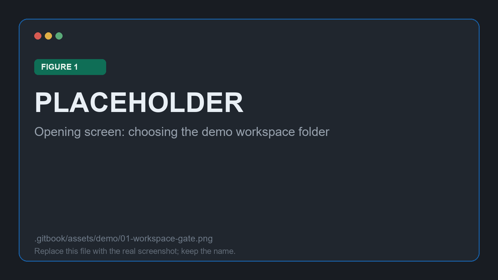
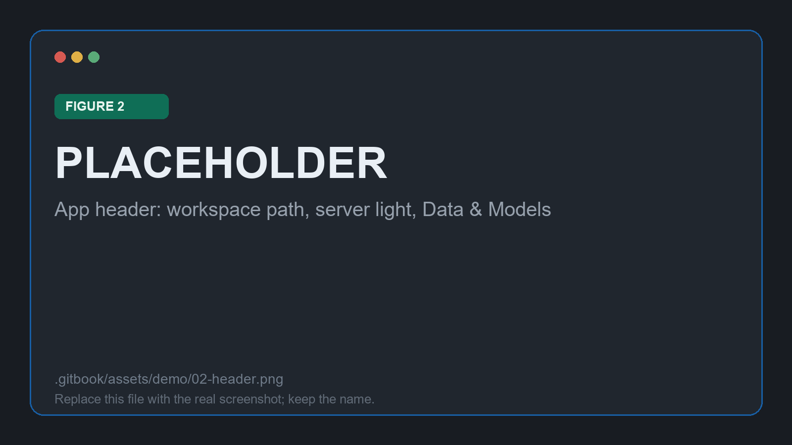
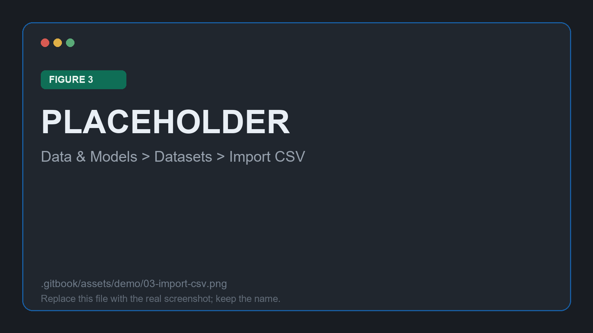
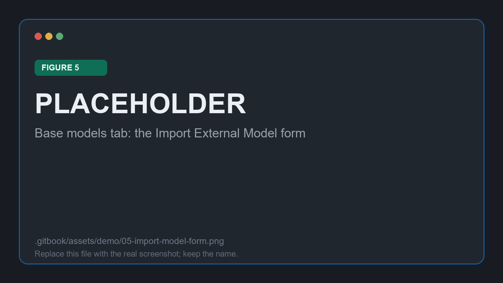
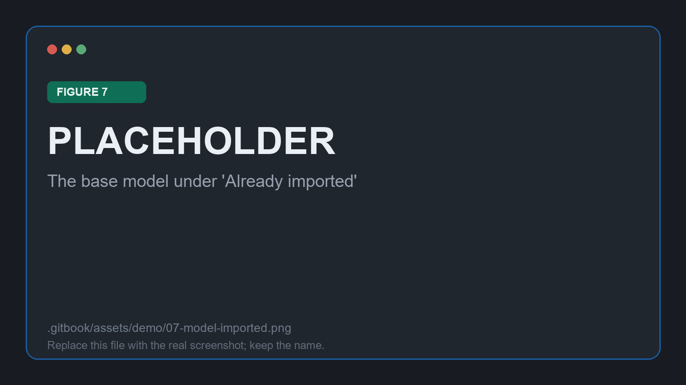

# Workspace and inputs

Nothing in MED3pa can run before a workspace exists, and no analysis can be configured before a dataset and a model are in it. This stage covers both.

## Opening the workspace

On first launch the application asks for a **workspace folder**. For this proof of concept a fresh, empty folder is the right choice: the workspace is where `DATA/` and `MODELS/` are created, and where the local MongoDB stores the sessions, deployments and patient records this walkthrough produces. Keeping the demo in its own folder keeps its sessions from mixing with other studies.

<figure><figcaption><p>Figure 1: choosing the workspace folder for the demo</p></figcaption></figure>

Once a folder is chosen, the module opens behind a thin header. The workspace path is on the left, and the status light shows whether the Go server is answering.

<figure><figcaption><p>Figure 2: the header, with the workspace path and the Data &#x26; Models button</p></figcaption></figure>


If the light is red, stop here. Open **System** and check the Python environment: the interpreter must have MED3pa installed, or every analysis will fail before it starts. See [Quick start](../quick-start.md#id-3.-python-environment).


## Importing the cohort

Open **Data & Models** from the header and stay on the **Datasets** tab. **Import CSV…** copies the chosen files into `DATA/` inside the workspace and re-scans it, which loads them into the local MongoDB and makes them selectable everywhere else.

<figure><figcaption><p>Figure 3: importing the MIMIC-95 CSV into the workspace</p></figcaption></figure>

For this demo, `MIMIC_95.csv` holds `{{N_PATIENTS}}` stays: the fifteen features listed on the [overview page](./), plus the `deceased` column carrying the outcome.

<figure><figcaption><p>Figure 4: the cohort now listed in the Datasets tab</p></figcaption></figure>


Importing takes a copy. Editing the original CSV afterwards changes nothing in the workspace, so re-import it if the cohort is regenerated.


## Importing the base model

Switch to the **Base models** tab. The model being audited here is `{{MODEL_FILE}}`, {{MODEL_ALGORITHM}} trained outside the application on the same feature set.

<figure><figcaption><p>Figure 5: the Import External Model form</p></figcaption></figure>

Four fields carry the demo:

| Field | Value used here |
| --- | --- |
| **Model file** | `{{MODEL_FILE}}` |
| **Model name** | A name you will recognise in the picker later; it is saved as `<name>.medmodel` |
| **Target column** | `deceased` |
| **Decision threshold** | `{{THRESHOLD}}` |

The **features** field is the one that repays care. It takes the fifteen columns, one per line or comma separated, **in the order the model expects them**, because rows are assembled in exactly that order when the model is called:

```
age, pao2fio2, uo, admissiontype, bicarbonate, bilirubin, bun, chron_dis,
gcs, hr, potassium, sbp, sodium, tempc, wbc
```

<figure><figcaption><p>Figure 6: the fifteen feature columns, in model order</p></figcaption></figure>


`deceased` is the target and is **not** a feature. Including it in this list would hand the model the answer and make every confidence estimate meaningless.



A pickled estimator that records its own feature names can be imported with the field left blank; the import reads the names from the model and fails loudly if it cannot. Typing them in is still the safer route, since it makes the expected order explicit in the record.


Import writes the model into `MODELS/` as a `.medmodel`. Before saving anything, the application calls the model on a sample row, so a model whose `predict_proba` cannot be reached is rejected here rather than halfway through an analysis.

<figure><figcaption><p>Figure 7: the base model listed under "Already imported"</p></figcaption></figure>

With a cohort and a model in the workspace, the analysis can be configured. Continue to [Configuring the run](configuration.md).
