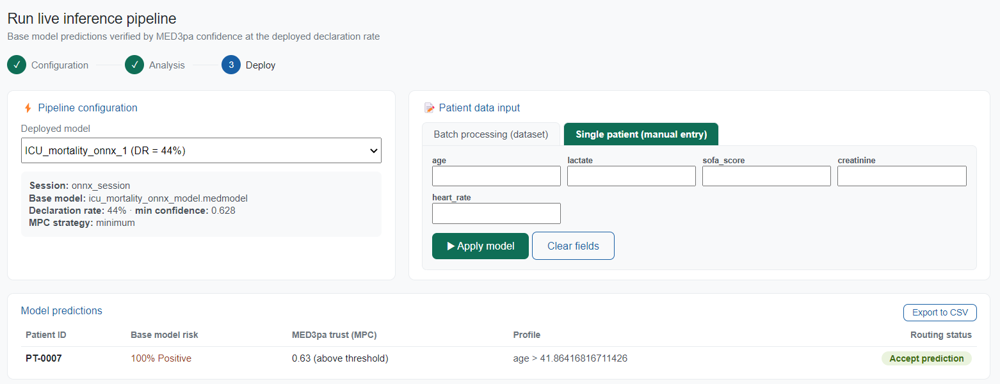

# 🚀 Deployment

Deployment is step 3. A **deployed model** is a session frozen at one declaration rate: the base model, the trained IPC and APC of that session, the MPC strategy, and the confidence threshold matching the chosen rate. It is created from the [Analysis Workspace](med3pa/analysis/analysis-workspace.md#creating-a-deployed-model); this page is where it is used.

<figure><figcaption>
<em>Deployment</em> page: pipeline configuration, patient input and the prediction table
</figcaption></figure>

### Pipeline configuration

Pick a deployed model from the selector; the panel underneath restates what it carries; the session it came from, the base model, the declaration rate and its minimum confidence, and the MPC strategy. If the list is empty, there is nothing to deploy yet: go back to the Analysis Workspace and create one.

### Patient data input

Two ways to feed it:



Select a workspace dataset containing the new patients and, optionally, a **Patient ID column**; identifiers are generated when none is given.

The dataset must carry every feature column the model was trained on; a missing one stops the run with an explicit message. The training target column is dropped if it happens to be present, so an already-labelled file can be reused without editing.



The form builds one numeric field per feature the deployed model declares, in the order the model expects them. All of them must be filled in before the model can be applied.

This is the quickest way to sanity-check a deployment, or to look at one specific case.



### Reading the results

Each prediction is a row in the **Model predictions** table:

| Column | Meaning |
| --- | --- |
| **Patient ID** | Given or generated |
| **Base model risk** | The base model's probability and the resulting positive/negative call |
| **MED3pa trust (MPC)** | The mixed confidence, and whether it clears the deployed threshold |
| **Profile** | The APC profile the patient falls into, as a readable rule |
| **Routing status** | What to do with the prediction |

Routing follows from the two confidence estimates and the deployed threshold:

| Status | Condition | Meaning |
| --- | --- | --- |
| 🟢 **Accept prediction** | MPC ≥ threshold **and** APC ≥ threshold | Both the individual estimate and the patient's profile clear the bar |
| 🟡 **Caution / review** | MPC ≥ threshold, APC below | The individual estimate clears the bar, but the patient belongs to a profile the base model handles poorly. Interpret with care |
| 🔴 **Flag for human audit** | MPC below threshold | Withhold the base model prediction and review manually |

**Export to CSV** writes the table out with the underlying numbers (base probability, prediction, IPC, APC, MPC, profile and routing), one row per patient.


Every prediction is also stored in the workspace database, which is what makes the [Patient lookup](patient-lookup.md) page possible. The table on this page only shows the current run.

