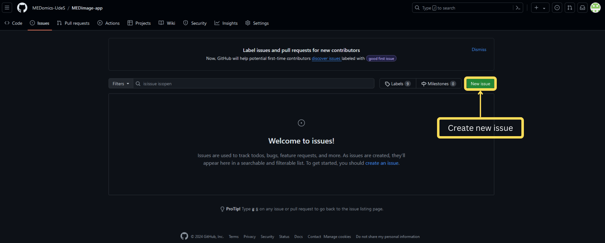
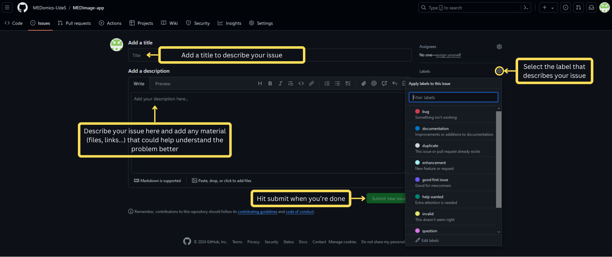

# ⚠️ Report an issue


Below is a brief guide on how to submit a new issue.


Use our [GitHub page](https://github.com/Thedetektive/MED3paApp/issues) to report any issue with the **application**. Issues with the method or the library itself belong to the [MED3pa package repository](https://github.com/MEDomicsLab/MED3pa/issues).

First, hit new issue to create a new one

<figure><figcaption></figcaption></figure>

Now, follow the steps described below to fill in the information about your issue and submit it

<figure><figcaption></figcaption></figure>


For a failing analysis, please include the Python environment path shown on the System page and the error reported by the progress dialog — most run failures come from the environment rather than the configuration.


If you have any questions or need further assistance, please do not hesitate to [contact us.](contact-us.md)
