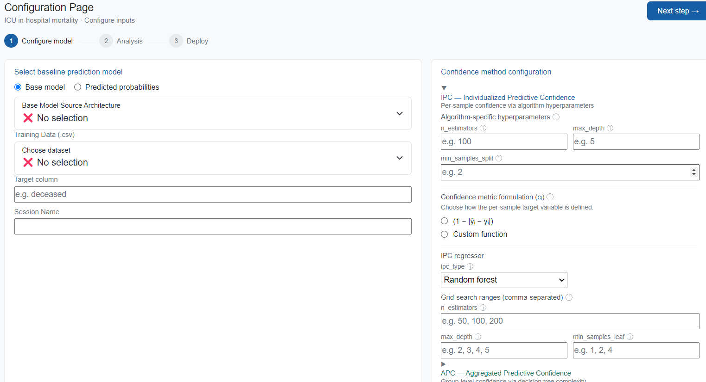
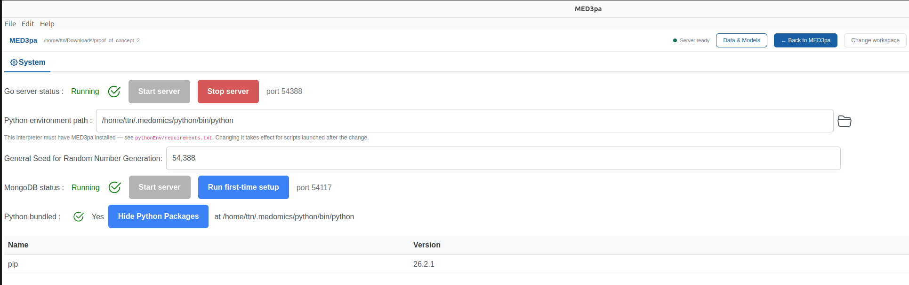

# 👀 Interface overview

### Opening page

Upon starting the application, a landing screen asks you to select a **workspace folder** before anything else can happen:

* the workspace holds your datasets under `DATA/` and your imported models under `MODELS/`;
* it is also what MongoDB is started against: the app writes `.medomics/mongod.conf` there and stores MED3pa sessions, deployments and patient records in that database.

Nothing in MED3pa can run before a workspace is selected. Folders you have opened before are listed under _Recent_, one click away.

### Header

Once a workspace is set, a thin header sits above the module. From left to right it holds:

| Element | What it does |
| --- | --- |
| **MED3pa** + workspace path | Reminds you which folder you are working in |
| Server status light | Green when the Go server answers, red when it does not. Clicking it jumps to the System page, where the server can be restarted |
| **Data & Models** | Opens the panel used to import CSV datasets and base models; see [Data & Models](med3pa/data-and-models/) |
| **System** | Switches to the settings page and back |
| **Change workspace** | Picks a different workspace folder |


The MED3pa page and the System page both stay mounted. Switching to System to fix the server or swap the Python environment does not lose an in-progress configuration or the results you were looking at.


### The MED3pa module

The module has its own sidebar with six entries, which follow the order of a typical study:

| Page | Purpose |
| --- | --- |
| **Overview** | Live counters (deployments, patients scanned, saved sessions) and a recent-activity feed |
| **Configuration** | Choose the base model, dataset, target column and confidence settings, then run the analysis. See [Configuration](med3pa/analysis/configuration.md) |
| **Analysis Workspace** | Explore a saved session: MDR curves, the APC profile tree, per-profile metrics; pick a declaration rate and create a deployed model. See [Analysis Workspace](med3pa/analysis/analysis-workspace.md) |
| **Deployment** | Apply a deployed model to new patients, in batch or one at a time. See [Deployment](deployment.md) |
| **Patient Lookup** | Search every patient a deployed model has scanned and open a full per-patient dashboard. See [Patient lookup](patient-lookup.md) |
| **Session History** | Log of previous analysis runs; click a row to reopen it in the Analysis Workspace |

A three-step progress bar, **Configure model → Analysis → Deploy**, is repeated at the top of the pages that belong to the main workflow, so it is always clear where in the study you are.

<figure><figcaption>
Configuration page, with the step bar at the top
</figcaption></figure>

### System page

The System page displays and controls everything the application needs in order to run:

* **Go server status**: running or stopped, on which port, with buttons to start and stop it.
* **Python environment path**: the interpreter used for every analysis. It must have MED3pa installed; see [Quick start](quick-start.md#id-3.-python-environment).
* **General seed** for randomized tasks, so a run can be reproduced.
* **MongoDB status**: running or stopped, on which port, plus a first-time setup helper.
* **Bundled Python**: whether the app ships its own interpreter, and the list of packages installed in it.

<figure><figcaption>
System page: server status and ports, the Python interpreter, the seed, and the bundled packages
</figcaption></figure>


If an analysis fails immediately, the Python environment is the first thing to check. The Go server needs an interpreter with MED3pa installed; without one, every request fails before the analysis starts.


**Now that you are familiar with the application and its various components, we recommend reading about the method itself in the next section. Good luck!** :wink:
