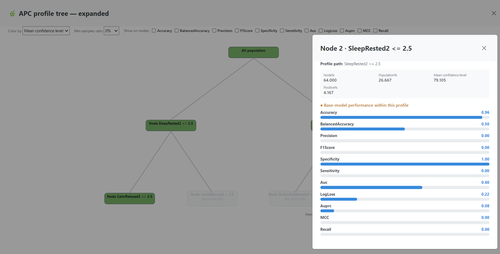
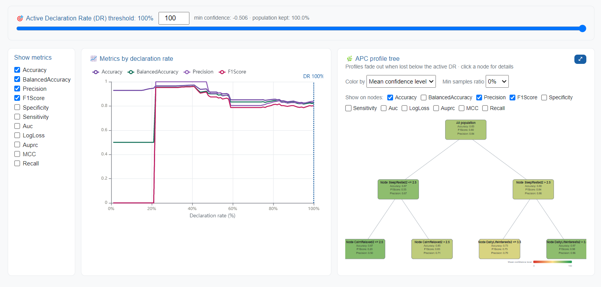

# 🧠 MED3pa

### What is MED3pa?

**MED3pa** stands for **P**redictive **P**erformance **P**recision **A**nalysis in **MED**icine. It addresses a problem that standard model evaluation hides: a single aggregate score describes a population, not a patient.

A model reported at 0.87 AUC is not 0.87-accurate for everyone. It could excellent on the cases that resemble its training data, but unreliable on the rest and nothing in the usual validation report tells a clinician which kind of patient is in front of them. MED3pa estimates that missing information: for every prediction, **how much can this particular prediction be trusted**, and for which **groups of patients** does the model fail systematically.

The method is described in the associated article published in the _Journal of the American Medical Informatics Association_: [https://doi.org/10.1093/jamia/ocag034](https://doi.org/10.1093/jamia/ocag034). The code used to produce the results in the article is available at [study\_3pa](https://github.com/MEDomicsLab/study_3pa).


MED3pa does not train your predictive model. It analyses a **base model** you already have trained anywhere, in any framework, put into a .pkl or .onnx file, together with an evaluation cohort. See [Base Models](data-and-models/base-models.md).


### The typical workflow

An analysis always follows the same three stages, which are also the three steps of the interface:

1. **Configure**: declare the base model, the evaluation dataset and the target column, then choose how confidence is to be estimated.
2. **Analyse**: read the declaration-rate curves, explore the profile tree, and decide at which confidence level the model should be allowed to answer.
3. **Deploy**: freeze that decision into a deployed model and apply it to new patients, who are then routed as _accept_, _caution_ or _flag for human audit_.

### The three confidence estimators

MED3pa produces three confidence signals, all on a `[0, 1]` scale where 1 means _trustworthy_.

#### IPC: Individualized Predictive Confidence

The IPC is a regressor trained to predict, **from a patient's features alone**, how well the base model did on that patient. The training target is a per-sample _confidence metric_ computed from the base model's probability and the true label. For example `1 − |ŷ − y|`, which is near 1 when the model was right and near 0 when it was confidently wrong.

Because the IPC only reads features, it can be evaluated for a new patient whose true label is unknown. That is what makes deployment possible.

#### APC: Aggregated Predictive Confidence

The APC is a decision tree that partitions the cohort on the same features. Each leaf is a **profile**: a readable rule such as `age > 65 & lactate <= 2.4`. Every patient falling into a leaf inherits that leaf's aggregated confidence, and the base model's performance is recomputed inside each profile.

This is what surfaces **disadvantaged profiles**, the groups where the base model consistently underperforms, which is exactly the information you need in order to refine a training set or retrain a model.

<figure><figcaption>
The APC profile tree; clicking a node shows the base model's performance inside that profile
</figcaption></figure>

#### MPC: Mixed Predictive Confidence

The MPC combines the two into the single number used for the accept/reject decision:

* **minimum** is `min(IPC, APC)`, conservative: a patient is trusted only when both the individual estimate and the profile agree;
* **average** is `mean(IPC, APC)`, more permissive;
* **custom** is any formula over `IPC` and `APC`, for example `0.6 * IPC + 0.4 * APC`.

### Declaration rate and the MDR curve

The **declaration rate (DR)** is the share of predictions the model is allowed to make. At a given DR, only the patients whose MPC confidence clears the matching threshold are _declared_; the rest are withheld.

Plotting each performance metric against the declaration rate gives the **MDR curve**, metrics by declaration rate. Read from right to left, it answers the question that matters when deploying a model: _what does the model's accuracy become if it is allowed to abstain on the least confident x% of cases, and how many patients does that abstention cost?_

<figure><figcaption>
Metrics by declaration rate, next to the APC profile tree
</figcaption></figure>

A model whose curve rises sharply as the declaration rate drops is one whose own uncertainty is informative: the predictions it is unsure about really are the ones it gets wrong. A flat curve is a warning that the confidence estimate carries little signal.

### Profiles that disappear

As the declaration rate falls, whole profiles can lose so many patients that they stop being reported at all. These are the **lost profiles**, and they matter: a profile that vanishes early is one the model is uniformly unsure about. In the application they fade out of the tree as you lower the DR, and a dot appears on the DR axis of the MDR curve at the exact rate where each one drops out.

**Craving more details? Read the** [**JAMIA article**](https://doi.org/10.1093/jamia/ocag034) **or the** [**package documentation**](https://med3pa.readthedocs.io/en/latest/)**.**
