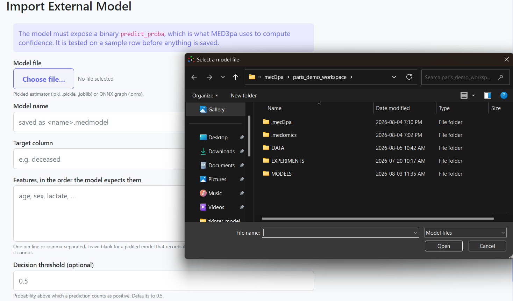

# Base Models

The **base model** is the classifier under study. MED3pa never trains it; it only calls it. Any model can be used as long as it can be exported and can return a probability for the positive class.

<figure><figcaption>
<em>Data &#x26; Models</em> panel — importing an external model
</figcaption></figure>

### Supported formats

| Format | Extensions | Notes |
| --- | --- | --- |
| Pickled estimator | `.pkl`, `.pickle`, `.joblib` | Any scikit-learn-style estimator exposing `predict_proba` |
| ONNX graph | `.onnx` | Must expose a probability output, or be declared as producing raw logits |

The import wraps the file as a `.medmodel` object stored under `MODELS/` in the workspace, which is what the rest of the application consumes.


The model must expose a **binary** `predict_proba` — that probability is what every confidence estimate is computed from. The import tests it on a sample row before anything is saved, so a model that cannot be called is rejected at import time rather than halfway through an analysis.


### Fields

Open **Data & Models → Base models** and fill in:

1. **Model file** — the pickled estimator or ONNX graph.
2. **Model name** — saved as `<name>.medmodel`.
3. **Target column** — the name of the label column the model predicts.
4. **Features, in the order the model expects them** — one per line, or comma-separated. Order matters: rows are assembled in the order given here. Leave blank for a pickled model that records its own feature names; the import reads them and fails if it cannot.
5. **Decision threshold** _(optional)_ — the probability above which a prediction counts as positive. Defaults to `0.5`.

### ONNX options

Two extra fields appear for `.onnx` files:

* **Outputs are raw logits** — tick this only if the graph was exported without its final sigmoid/softmax.

  
  This cannot be detected automatically, and getting it wrong produces confidence scores that look plausible but are wrong.
  

* **Probability output name** — only needed when the graph has several outputs and none of them is named for probabilities.

### After importing

The model appears under _Already imported_ in the panel and becomes selectable as the **Base Model Source Architecture** on the [Configuration](../analysis/configuration.md) page. Its declared feature list is what the deployment form later uses to build the manual single-patient entry fields.
