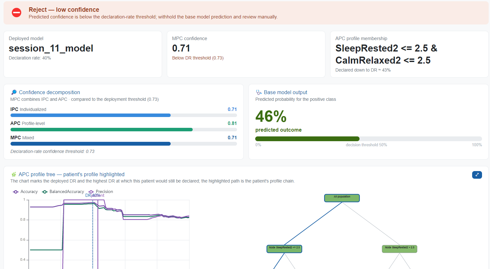

# 🔎 Patient lookup

Every patient a deployed model has scanned is kept in the workspace database. The Patient Lookup page searches across all of them, and opens a full dashboard for any one of them.

### Searching

Enter a patient identifier — or leave the box empty to list everything — and press **Search**. Each result card summarises one scan: the base model prediction, the MPC confidence, the action recommendation, the profile the patient fell into, and which deployed model produced it.

Clicking a card opens the patient's dashboard.

### The patient dashboard

<figure><figcaption>
Patient dashboard — recommendation banner, confidence decomposition and base model output
</figcaption></figure>

The dashboard answers, for one patient, why the model was or was not trusted.

**Recommendation banner.** The routing decision in plain words:

| Banner | Meaning |
| --- | --- |
| ✓ **Accept — reliable prediction** | Confidence clears the declaration-rate threshold and the patient is not in a flagged profile |
| ⚠ **Caution — weak profile** | Individual confidence clears the threshold, but this patient belongs to a profile the base model handles poorly |
| ⛔ **Reject — low confidence** | Predicted confidence is below the threshold; withhold the base model prediction and review manually |

**Headline figures.** The deployed model and its declaration rate; the MPC confidence against the threshold; and the APC profile membership, together with the lowest declaration rate at which this patient would still have been declared — a direct measure of how marginal the case is.

**Confidence decomposition.** IPC, APC and MPC drawn as bars against the deployment threshold, so it is immediately visible whether an individual estimate or a weak profile is what pushed the patient below the line.

**Base model output.** The predicted probability for the positive class, positioned against the model's decision threshold.

**MDR curve and profile tree.** The same two charts as the [Analysis Workspace](med3pa/analysis/analysis-workspace.md), reproduced for this patient: the chart marks the deployed DR and the highest DR at which this patient would still be declared, and the tree highlights the patient's profile chain from the root down to their leaf.

### Session History

The sibling page, **Session History**, is the equivalent log for analyses rather than patients: date, session name, base model, dataset, target column, cohort size and status for every run saved in this workspace. Clicking a row reopens that session in the Analysis Workspace.
