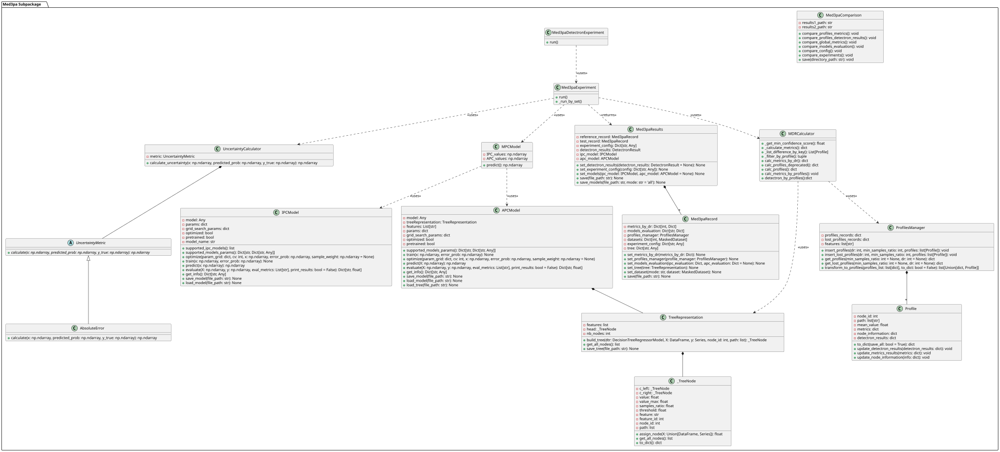

# 🐍 The MED3pa package

Everything the application computes is computed by the [MED3pa Python package](https://github.com/MEDomicsLab/MED3pa). The interface exists to make the method reachable without writing code; the package is there when you need to go further — batching many experiments, embedding the analysis in a pipeline, or extending the method itself.

<figure><figcaption><p>The <code>med3pa</code> subpackage: IPC, APC and MPC models and the tree representation behind the profiles</p></figcaption></figure>

### Subpackages

| Subpackage | Responsibility |
| --- | --- |
| `datasets` | Stores and manages the dataset |
| `models` | Handles ML model operations, including the base model wrapper |
| `med3pa` | Evaluates the model's performance and extracts disadvantaged profiles |

### Installation


The library is **not on PyPI**. The application pins it to a specific GitHub commit in `pythonEnv/requirements.txt`, and Python 3.12 is required — see [Quick start](quick-start.md#id-3.-python-environment).


```bash
pip install git+https://github.com/MEDomicsLab/MED3pa.git
```

### A simple example

```python
from MED3pa.datasets import DatasetsManager
from MED3pa.med3pa import Med3paExperiment
from MED3pa.models import BaseModelManager
from MED3pa.visualization.mdr_visualization import visualize_mdr
from MED3pa.visualization.profiles_visualization import visualize_tree

# Initialize the DatasetsManager
datasets = DatasetsManager()
datasets.set_from_data(dataset_type="testing",
                       observations=x_evaluation.to_numpy(),
                       true_labels=y_evaluation,
                       column_labels=x_evaluation.columns)

# Initialize the BaseModelManager
base_model_manager = BaseModelManager(model=clf)

# Execute the MED3pa experiment
results = Med3paExperiment.run(
    datasets_manager=datasets,
    base_model_manager=base_model_manager,
    **med3pa_params
)

# Save the results to a specified directory
results.save(file_path='results/oym')

# Visualize results
visualize_mdr(result=results, filename='results/oym/mdr')
visualize_tree(result=results, filename='results/oym/profiles')
```

The `med3pa_params` dictionary holds the same settings the [Configuration](med3pa/analysis/configuration.md) page fills in — the IPC and APC hyperparameters, the MPC strategy and the samples-ratio sweep.


Passing a built-in confidence metric **by name** is known to raise a `TypeError` in the library. Pass the metric callable instead if you hit it. The application always passes callables, which is why the same configuration works there.


### Going further

* [Package documentation](https://med3pa.readthedocs.io/en/latest/) — tutorials for the `datasets`, `models` and `med3pa` subpackages.
* [Examples](https://github.com/MEDomicsLab/MED3pa/tree/main/examples) — runnable notebooks, including a full one-year-mortality study.
* [study\_3pa](https://github.com/MEDomicsLab/study_3pa) — the complete code behind the results reported in the JAMIA article.

Please feel free to [contact us](forms/contact-us.md) if you need any further assistance :innocent:.
